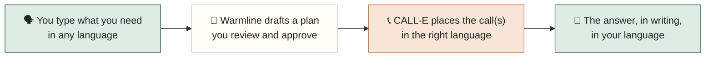

<div align="center">

# 🌷 Warmline

**An accessibility-first calling concierge.**

Say what you need, in any language. Warmline makes the phone call for you,
and gives you the answer back in writing, in your own language.

### [▶︎ Try the live demo](https://warmline-production-a583.up.railway.app/)

<sub>Live at **warmline-production-a583.up.railway.app** — no sign-up, runs in mock mode so you can walk the whole flow safely.</sub>


&nbsp;

&nbsp;

&nbsp;


React 19 · TypeScript · Fastify · powered by [CALL-E](https://call-e.devpost.com/)

</div>

---

## The idea

Phone calls are a wall for a lot of people. If you are Deaf or hard of hearing,
if English is not your first language, or if calling a stranger fills you with
dread, a simple "call the clinic and ask when they open" can be genuinely hard.
Millions of people quietly put off appointments, benefits, and everyday errands
for exactly this reason.

Warmline takes that whole task off your plate. You type what you need, in
whatever language you think in. Warmline turns it into a plan you approve, places
the call through CALL-E, and hands the answer back to you **in writing, in your
language**. The entire experience is typed and read, so **you never have to hear
or speak on a call.** It is, in effect, a modern, multilingual, AI take on a
relay service — built for anyone who finds phone calls hard.

> Built for **Deaf and hard-of-hearing callers**, **non-native speakers**, and
> **anyone who finds phone calls hard.**

## What you can actually do with it

Warmline is not just an intent form with a call button. In a single, calm flow it lets you:

- **Describe a task in any of 30+ languages** and have the whole interface
  translate itself to match — before you have typed anything, or automatically
  from what you wrote.
- **Aim the same task at up to five businesses at once** — call every dentist on
  your list, then read their answers **side by side**.
- **Let Warmline pick the winner.** Each result carries a confidence rating
  (high / medium / low), and the best confident answer is flagged with a
  **"best answer" badge**, so you do not have to compare rows yourself.
- **Read structured answers, not transcripts.** Every call comes back as typed
  fields — availability, price, hours, outcome — plus short **evidence lines**
  quoting what was actually said on the call.
- **See it in two languages at once.** Results render in your language *and*
  English with a one-tap toggle, so an English-speaking friend or family member
  can read along.
- **Hear it out loud.** When you would rather listen than read, Warmline can call
  you back and read the results aloud in your language.
- **Stay in control the whole way.** Nothing dials until you approve the plan,
  the agent always discloses it is an AI, and it never books, pays, or commits
  to anything.

## How it works



A calm three-screen flow: **describe → review → results.** Nothing calls anyone
until you say so.

<!-- Screenshots: drop UI captures into docs/screenshots/ and reference them here. -->

## Four ways to ask, one flow

Warmline reads your free text and routes it to the mission template that fits,
each with its own intake and typed result schema:

| Mission | What it is for | Example |
|---------|----------------|---------|
| **Appointment scout** | Find the earliest opening without booking anything | "When is the earliest dentist appointment this week?" |
| **Lost & found** | Check whether a place has your lost item | "Did I leave a blue umbrella at the library yesterday?" |
| **Reachability check** | Confirm hours, whether they are open, or that a number reaches a human | "Is the pharmacy open right now and do they take walk-ins?" |
| **Generic errand** | Any other single question for a business | "Ask the bakery if they have gluten-free bread today." |

You do not pick the template — Warmline classifies your request (via an LLM, with
a keyword fallback when no key is set) and generates a concrete, do-no-harm call
goal like *"ask for the earliest appointment; do not book anything."*

## Speaks the user's language, everywhere

Language is not a setting you hunt for. Warmline meets people where they are:

- **Auto-detect from what you type.** Write your request in any language, and the
  button offers to flip the page into it by name: *"Show this page in Español."*
- **Or pick it directly.** Choosing from the language dropdown translates the
  whole interface instantly, even before you have typed anything, for someone who
  cannot read the English form at all.
- **30+ languages** in the picker, from Spanish, Chinese, and Vietnamese to
  Arabic, Hindi, Haitian Creole, Amharic, Somali, and Ukrainian — and because the
  UI is translated live by an LLM, any language works, not just the listed ones.
- **An in-language "loading" moment.** While the page switches, the wait itself
  already speaks their language.
- **Answers in two languages.** Results come back in the person's language *and*
  English, with a one-tap toggle, so an English-speaking friend or family member
  can read along.
- **Or hear it out loud.** When the task is done, Warmline can call the person
  back and read the results aloud in their language, on top of the written
  answer, for anyone who would rather listen than read.
- **A language switcher is always in the top-right**, so it is never a hunt.
- **Right-to-left aware** for Arabic, Farsi, Urdu, Pashto, and Hebrew.

Two independent "language knobs" make this work:

| Knob | Controls | Powered by |
|------|----------|------------|
| `userLocale` | The interface and the written answer | LLM translation (Claude or OpenAI) |
| `callLocale` | The language the agent **speaks on the phone** | CALL-E's region + locale |

So the person can read the interface in Tagalog while the agent calls a clinic in
English — or the reverse. The two ends of the call are decoupled on purpose.

A live example of the interface translating itself:

| English | Español (detected live) |
|---------|-------------------------|
| Show this page in my language | Mostrar esta página en mi idioma |
| View in English | Ver en inglés |

## Built on CALL-E

Warmline places its real phone calls through [**CALL-E**](https://call-e.devpost.com/)
("Your Code Is Calling"), an agentic calling platform: you hand it a task and a
phone number, and its voice agent makes the call and hands back a structured
result. CALL-E is what turns Warmline from a nice intent form into something that
actually reaches a human on the other end.

**How the integration works** (`server/index.ts`): for each approved target,
Warmline calls `CalleClient.calls.createAndWait(...)` from the `@call-e/calle`
SDK, passing:

- **`task`** — the per-mission call goal Warmline generated from the user's intent
  (e.g. "ask for the earliest appointment; do not book anything"), always prefixed
  with a spoken AI-disclosure line and a hard rule that the agent must not book,
  pay, or commit to anything.
- **`recipient`** — the business phone in E.164, plus a **`locale`** (the
  `callLocale`) and a **`region`** so the call can happen in a different language
  than the person's own interface. CALL-E ties the language its agent *speaks* to
  the recipient region (Spanish under `MX`, Hindi under `IN`, Arabic under `AE`,
  and so on), so Warmline maps the chosen `callLocale` to a region CALL-E supports
  that language in (`regionForCallLocale`), falling back to `CALLE_REGION`.
- **`resultSchema`** — the mission's structured-output schema, so CALL-E returns
  typed fields (availability, price, outcome, evidence) instead of a blob of text.
- **`metadata`** and an **`idempotencyKey`** — so every call is traceable and can
  never be accidentally placed twice.

Warmline uses CALL-E **twice** in the same flow: once to call the **business** and
get the answer, and again, optionally, to call the **user back** and read that
answer aloud in their language. The structured result CALL-E returns is what makes
the callback trustworthy — Warmline reads back typed fields, not an improvisation.

## Trust and safety

"Call anyone" only stays safe with guardrails. Every CALL-E call is wrapped in:

- ✅ **Approval-first review** — you confirm the plan before anything dials.
- ✅ **Spoken AI disclosure** — the agent always says it is an AI.
- ✅ **Server-side allowlist** (`CALLE_ALLOWED_NUMBERS`) and **E.164 validation**.
- ✅ **Never books, pays, or commits** anything on your behalf.
- ✅ **Idempotency keys** per call and a **max of 5 targets**.
- ✅ **Off by default** — real calls run only when `ALLOW_REAL_CALLS=true`,
  `CALLE_API_KEY` is set, and the number is allowlisted. Otherwise Warmline uses a
  deterministic mock engine.

## Under the hood

- **Intent interpretation** (`src/domain/interpret.ts`): real LLM classification
  and field extraction, with a keyword-classifier fallback if no key is set.
- **Four mission templates** (`src/domain/missions/`): lost & found, appointment
  scout, reachability check, and a generic catch-all, each with its own intake and
  result schema and its own confidence/evidence handling.
- **Translation boundaries** (`src/domain/translate.ts`): batched LLM translation
  at each language edge, a no-op when the two locales match, with results cached.
- **Provider-agnostic LLM layer** (`src/domain/llm.ts`): works with **either** an
  Anthropic key or an OpenAI key. If both are set, Anthropic is preferred. An
  OpenAI key pasted into `ANTHROPIC_API_KEY` by mistake still works, since
  Warmline only treats it as Anthropic if it starts with `sk-ant`.
- **Fully offline-safe**: with no keys set, everything falls back to keyword
  interpretation, marker-stub translation, offline locale detection, and mock
  calls, with no network requests at all — so the live demo above walks the entire
  flow without dialing a single real number.

## Quickstart

```bash
pnpm install
pnpm dev
```

Open `http://localhost:5173`. The Vite dev server proxies `/api` to
`http://localhost:8787`.

Production build:

```bash
pnpm build
pnpm start
```

Or skip setup entirely and try the hosted version:
**[warmline-production-a583.up.railway.app](https://warmline-production-a583.up.railway.app/)**

## Environment

Copy `.env.example` to `.env` and set what you need:

| What you set | What you get |
|--------------|--------------|
| Nothing | Keyword interpretation, stub translation, mock calls. Fully offline. |
| `ANTHROPIC_API_KEY` **or** `OPENAI_API_KEY` | Real LLM interpretation, translation, and UI localization. Calls still mocked. |
| An LLM key **+** `ALLOW_REAL_CALLS=true` **+** `CALLE_API_KEY` **+** `CALLE_ALLOWED_NUMBERS` | Real phone calls via CALL-E, restricted to the allowlisted numbers. |

## Project structure

```text
src/
  App.tsx              Three-screen intent -> plan -> results UI
  i18n/strings.ts      English source strings (everything else is translated live)
  domain/
    base.ts            Shared target/mission schemas, safety preamble, guards
    template.ts        MissionTemplate<TInput, TData> contract
    missions/          lostAndFound, appointmentScout, reachability, generic
    registry.ts        kind -> template lookup
    interpret.ts       free-text -> plan (LLM, keyword fallback)
    translate.ts       locale-boundary translation (LLM, stub fallback)
    llm.ts             provider-agnostic LLM layer (Anthropic + OpenAI)
  styles.css
server/
  index.ts             Fastify API: intent, missions/run, localize, callback, health; CALL-E path
docs/
  mission-templates-spec.md   Design + mission-template spec
  DEVPOST_SUBMISSION.md        CALL-E hackathon submission copy
```

## License

MIT
